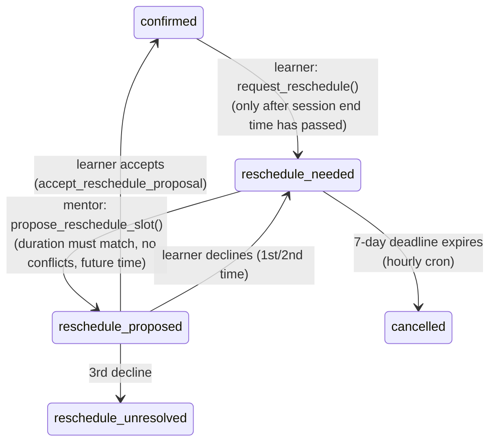

# Connectiqo Technical Project Report

2026-09-24 · prepared with Claude

## 1. Overview & Tech Stack

Connectiqo is a marketplace for live 1-on-1 video mentorship: every account is simultaneously a mentor and a learner, booking and hosting paid video sessions, buying and selling pre-recorded video content, and building a public creator profile.

| Layer | Technology |
| --- | --- |
| Framework | Next.js 16.2.11 (App Router, Turbopack) |
| UI | React 19.2.4, Tailwind CSS v4, lucide-react icons |
| Backend | Supabase — Postgres 17, Auth, Storage, Edge Functions (Deno), Row-Level Security, pg_cron + pg_net |
| Video calls & recording | VideoSDK.live (`@videosdk.live/react-sdk`) |
| Payments | Razorpay (orders, webhooks, standard checkout) |
| Error tracking | Sentry (`@sentry/nextjs`) |
| Charts | Recharts (earnings dashboard) |
| Deployment | Docker container running the Next.js app behind Caddy (reverse proxy/TLS), fronted by Cloudflare (CDN/DNS proxy) |

**Architecture in one line:** the Next.js app talks directly to Supabase from the browser for most reads/writes (governed by Postgres RLS policies, not a custom API layer), and calls Supabase Edge Functions for anything that needs a secret key or server-side authority — creating payment orders, verifying payments, sending push notifications, enforcing login lockouts, and reconciling webhooks.

The production app is served at `app.connectiqo.com`; a separate, independently maintained marketing/landing site lives at `connectiqo.com` and is where logged-out visitors to the app are redirected.

## 2. Authentication & Account Security

**Sign in** goes through a custom edge function, `login-with-lockout`, rather than calling Supabase Auth directly from the browser: it tracks failed attempts per email in a `login_attempts` table and locks an account out for 5 minutes after 3 consecutive failures, before Supabase Auth is even called.

**Sign up** is split into two stages so it works correctly whether or not email confirmation is required:
1. `authApi.signUp()` creates only the Supabase Auth user.
2. `authApi.createProfile()` inserts the `profiles` row — deliberately separated, because that insert is RLS-gated on `auth.uid() = id` and therefore needs an active session, which does not exist yet if email confirmation is pending.

**Email OTP verification** was added to close a real gap: every existing account had been auto-confirmed with no proof of email ownership. The flow now: Supabase's "Confirm email" setting is enabled, the "Confirm signup" template sends a 6-digit `{{ .Token }}` code (not a link), and `/signup` shows a **Verify your email** step calling `authApi.verifySignupOtp()` before the profile rows are created. Outbound mail is sent via custom SMTP (Hostinger, `noreply@connectiqo.com`) rather than Supabase's default mailer, which is rate-limited to a few emails/hour.

**Forgot password** is a 3-step OTP flow (`/forgot-password`): send code → verify code → set new password. Verifying the code via `supabase.auth.verifyOtp` has a side effect of creating a real session, so the page sets a `pendingPasswordReset` flag on `AuthContext` to stop the app shell from treating that transient session as a real login.

**Known open issue:** `pendingPasswordReset` is plain React state — it does not survive a page reload or the tab closing. If a user verifies their reset code and abandons the flow before setting a new password, the leftover session persists in the browser and would silently log them in on return, without ever setting a new password. Not yet fixed.

## 3. Onboarding

Every account is created dual-role: signup calls `createMentorProfile()` and `createLearnerProfile()` together, so a single login can both book sessions as a learner and receive bookings as a mentor — there is no separate "become a mentor" account type.

Right after verification, new users land on `/onboarding/interests`: a category picker (min/max interest count enforced client-side via `MIN_LEARNER_INTERESTS`/`MAX_LEARNER_INTERESTS`) that drives personalization elsewhere in the app — the Home "Recommended For You" video row and the `/recommended` page both filter by these saved interests. If a user's matched-interest count later drops below the minimum (e.g. an admin renames or removes a category they'd picked), `InterestsPromptBar` resurfaces a dismissible nudge to update their picks.

## 4. Mentor & Learner Profiles

Profile data spans three tables: `profiles` (name, email, username, role), `mentor_profiles` (bio, category, `price_per_hour`, social links, payout details, KYC status), and `learner_profiles` (bio, saved interests). A generated username (email prefix + random suffix) powers clean public profile URLs like `/mentor/<username>`.

**Editing:** `/settings/profile/edit` covers bio, experience, price per session, location, and social links (website, LinkedIn, X, Instagram, YouTube).

**Public profile page** (`/mentor/[mentorId]`) shows stats, bio, the video library, reviews, and a **QR/share** modal so a mentor's profile can be shared as a scannable code or copied link — built with a `navigator.share`/clipboard fallback chain for browsers where one or the other API is unavailable in a non-secure context.

**Mentor freeze:** an admin-only moderation control (`mentor_frozen`, `mentor_frozen_until`, `mentor_freeze_reason`) that hides a mentor's videos and profile from public visibility without deleting anything — checked via a shared `mentor_freeze_is_active()` Postgres function referenced from multiple RLS policies (profile visibility, video visibility, unlock eligibility).

## 5. Discovery, Search & Categories

`/discover` lists mentors grouped by category as horizontally-scrolling rows, each mentor grouped by `mentor_categories` (an admin-managed, active/inactive taggable list). A debounced search box matches by name, `@username`, or skill.

The Home dashboard surfaces two more discovery surfaces: a **Top Categories** quick-filter strip and a **Popular Creators** row (trending mentors passed down from the server as `MentorProfileRow[]`). Category browsing also has dedicated `/category/[category]` pages for deep-linking into one category from outside the app (e.g. a shared link).

## 6. Booking & Scheduling

Mentors publish `availability_slots`; learners can book a single slot or several **continuous, same-day** slots in one checkout (validated server-side in the order-creation function — slots must be contiguous and belong to the same mentor). A booking's lifecycle runs through `pending → confirmed → completed`, with `cancelled` and a dedicated reschedule branch.

**Reschedule flow** (reworked to be backend-enforced, not just client-validated):



All three learner/mentor-facing writes are `SECURITY DEFINER` RPCs (`request_reschedule`, `propose_reschedule_slot`, `decline_reschedule_proposal`) rather than plain client `.update()` calls, closing gaps the earlier client-only version had: a learner could previously mark a session for reschedule before it had even started, and there was no cap on repeated declines. A mentor's proposal must match the original session's exact duration and not conflict with any of their other bookings that day; a proposal expires after 48 hours; a booking stuck in `reschedule_needed` past a 7-day deadline is auto-cancelled by an hourly `pg_cron` job (`expire-reschedule-deadlines`), which also frees the underlying slot.

`reschedule_requests` is a realtime-replicated table so a learner's "review proposal" prompt appears without a manual refresh.

## 7. Live Video Calls

Built on VideoSDK.live's React SDK (`MeetingProvider`/`useMeeting`/`useParticipant`). `/call/[bookingId]` hosts the room with two switchable layouts — side-by-side and a min/max (pinned participant + floating PiP tile) — plus screen share (with a mirrored floating self-view), in-call chat, mic/camera toggles, fullscreen, and a small "Connectiqo" watermark burned into every tile.

**Video quality:** turning the camera on captures via `createCameraVideoTrack()` with explicit `optimizationMode: "detail"`, `bitrateMode: "high_quality"`, and the `H264` codec, instead of the SDK's defaults (`"motion"`/`"balanced"`/VP8), which visibly softened the picture once WebRTC's congestion control kicked in on a constrained connection — most noticeable on mobile networks. `facingMode: "user"` is pinned explicitly, since the SDK's own unset default is the **rear** camera on mobile web — a regression that would only ever surface on the exact platform (mobile) this fix targeted, and so was easy to miss.

On the receiving side, each `ParticipantTile` calls `setQuality("high")` for every remote participant — without it, VideoSDK's simulcast auto-selection can settle a viewer on a lower resolution layer than the sender is actually capable of, regardless of how good the sender's own encode is. Both the send-side and receive-side fixes were needed together; either alone was insufficient.

## 8. Session Recording

Recording uses VideoSDK's REST API (`POST /v2/recordings/start`) rather than the SDK's native `startRecording()`, because only the REST call accepts a custom `templateUrl` — the native method has no way to brand the output. That template is `/recording-template`, a headless route this same Next.js app serves: VideoSDK's recording bot joins the room as an invisible "Recorder" participant and loads that page, which composites both participants into a branded, landscape, side-by-side layout mirroring the mobile app's own recording template.

Recording's composite quality (the REST call's `config.quality`) was capped at `"med"` for a period as an untested workaround for a separate bug — the recorder bot dropping out of **web-to-web** calls specifically (confirmed via VideoSDK's `recording-failed` webhook), suspected to be an SFU/bandwidth issue during the bot's connection setup. That investigation was never conclusively resolved; quality has since been reverted to `"high"` alongside the live-call video quality fixes above, but **whether the original web-to-web drop-out bug is actually fixed remains unverified** — it needs a real two-browser test call to confirm.

Completed recordings are viewable on `/settings/recordings` (paginated, "Load more").

## 9. Payments — Session Bookings

A two-step Razorpay flow, both steps server-side edge functions so pricing can never be tampered with client-side:

1. `create-razorpay-order` — re-derives the price from `mentor_profiles.price_per_hour` (never trusts a client-supplied amount), applies the platform fee, and creates the Razorpay order.
2. `verify-razorpay-payment` — confirms the payment signature and atomically creates the `bookings` row.

**Fee formula** (from the live `platform_fee_rules` row: 10% platform fee, 18% GST):

```
total = mentorPrice + (mentorPrice × 0.10) + (mentorPrice × 0.10 × 0.18)
```

GST is charged on the platform's fee only, not on the mentor's price — the standard way a marketplace passes through GST on its own commission. A ₹250 session therefore totals ₹279.50 (rounded to ₹280), of which ₹250 reaches the mentor's wallet.

**`razorpay-webhook`** is a reconciliation safety net: if a client crashes or loses connection right after Razorpay captures payment but before `verify-razorpay-payment` runs, the webhook independently confirms the booking from Razorpay's own `payment.captured` event, guarded against double-booking by a unique index on active slot bookings.

**Going live** surfaced a real mismatch worth remembering: a payment-gateway KYC form declared a ₹99–₹999 transaction range that didn't match actual charges once fees were included (a ₹999 mentor price actually charges ₹1,117) — a reminder that any declared transaction limits need to account for the fee on top of the sticker price, not just the sticker price itself.

## 10. Video Content Library

Mentors upload videos (up to 80MB, direct browser → Supabase Storage) on `/mentor/videos`, marking each as a free preview or members-only. There's no streaming/transcoding pipeline — the raw uploaded file is served as-is and played back with a plain HTML5 `<video>` tag; access gating happens before playback (a locked video never loads a `<video>` element at all), not via DRM.

**Unlocking:** a learner pays a mentor's chosen tier (₹199/299/499/799/999, enforced server-side against that fixed list) for 30 days of access to all their non-free videos, via the same order-then-verify pattern as session bookings (`create-video-order` / `verify-video-subscription`), sharing the identical fee formula.

**The `/videos` feed** is a TikTok-style vertical, swipeable discovery surface across all mentors, sorted **promoted-first, then newest** (`is_promoted`/`promoted_at`, an admin lever — see Admin Tools). It supports deep-linking to one specific video via `?videoId=`, so a card clicked elsewhere (e.g. Home's "Recommended For You") opens the feed already on that video instead of always the newest one overall — fetching it directly if it falls outside the first loaded page.

A mentor's own video list (`/mentor/videos`) and the public profile's video library both paginate with "Load more" rather than loading everything at once.

## 11. Reactions (Likes/Dislikes)

A `video_reactions` table (one row per `video_id` + `user_id`, unique-constrained so switching a like to a dislike replaces the row rather than adding a second vote) backs thumbs up/down buttons on the `/videos` feed, with a `video_reaction_counts` view pre-aggregating totals per video so the app never runs `COUNT()` client-side.

The feed updates optimistically — tapping a reaction flips the button and adjusts the count immediately, then reconciles with the server in the background, reverting on failure. Counts are also surfaced read-only on a mentor's own "My Videos" management page and on the public profile's video library, so a mentor can see how their own content is landing.

## 12. Notifications & Session Reminders

Two genuinely different notification systems exist, easy to conflate:

- **The in-app bell** is *event*-driven, not time-based — it's derived live from `bookings` status changes (booked, confirmed, cancelled, completed, reschedule proposed). It has no concept of "time until session start."
- **Push notifications (FCM)** are sent by a family of `notify-*` edge functions triggered by specific events: `notify-new-booking`, `notify-booking-status`, `notify-reschedule`, `notify-withdrawal-status`.

**Session reminders** ("starts in 15 minutes") are a third, distinct mechanism: `notify-session-reminders` computes each booking's exact session-start instant and sends FCM to both parties inside a ~15-minute window (13–16 minutes out, widened deliberately so a 1-minute poll cadence can't skip a booking between ticks), claiming each booking atomically first so concurrent cron ticks can't double-send. This function existed in the codebase but was **never actually wired to run** — Edge Functions only execute on an HTTP call, and no cron job called it. It's now scheduled via `pg_cron` + `pg_net` (`SELECT net.http_post(...)` on a `* * * * *` schedule), verified end-to-end by inspecting the actual HTTP response Postgres received back. At ~43,200 invocations/month, this is a small fraction of even the free-tier Edge Function quota — cost was not a real constraint here despite an initial concern that it would be.

## 13. Wallet, Earnings & Payouts

Every paid booking or video unlock writes an `earnings` row (tagged `source: 'session'` or `'video_subscription'`) and credits the mentor's `mentor_wallets` balance. `transactions` is the authoritative Razorpay payment ledger, separate from `earnings`, which is the payout-facing ledger.

**Payouts are manual, not automated** — despite `create-linked-account` and `get-account-status` edge functions existing (built for Razorpay Route, which would let the platform transfer money to mentors automatically), the actual code path explicitly does not use them: a mentor requests a withdrawal (`withdrawal_requests`, against their configured UPI ID), and an admin settles it manually via UPI/IMPS/NEFT outside the app, then marks it paid. Route infrastructure exists in the codebase but is not part of the live money-movement path.

The wallet page shows balance, transaction history, and a Recharts earnings-over-time chart.

## 14. Reviews & Ratings

A learner reviews a completed session (`reviews`: rating + comment, tied to a booking). `mentor_profiles.rating` is a cached average, kept in sync by an **insert-only** trigger (`update_mentor_rating`, fires on `INSERT` to `reviews`) that recomputes `AVG(rating)` for that mentor — there is no corresponding update/delete trigger, so if a review is ever edited or removed directly, the cached rating would silently go stale.

All of the platform's dummy/test transactional data — test bookings, transactions, and reviews accumulated during development — was identified and removed directly from the database, carefully preserving the small number of genuinely real transactions and recomputing affected mentor wallet balances and ratings afterward, rather than resetting the whole dataset.

## 15. Admin Tools

An `/admin` dashboard with dedicated `/admin/users` and `/admin/videos` sections, gated by an `admins` table and a shared `is_admin()` Postgres function referenced from RLS policies across many tables (profiles, mentor_videos, reviews, and others each carry their own `admin_all_*`/`*_admin_*` override policies rather than one central admin check).

Admin capabilities include: freezing a mentor's account (see Mentor & Learner Profiles), promoting a video to the top of the `/videos` feed (`is_promoted`), and moderation via `user_reports` — a report can be filed from a profile or from inside a booking/call context through the shared `ReportUserModal` component.

## 16. Settings & Account Management

`/settings` is organized into a profile summary card (avatar, name, username, role badge, lifetime stats) plus grouped sections: **Preferences** (appearance/theme, notifications, my bookings), **Payments & Earnings** (wallet, payouts, transaction history), and **Content & Library** (recorded sessions, video subscriptions).

Theme is light/dark with no flash-of-wrong-theme on load (an inline script reads the stored preference before hydration). Account deletion runs through a `delete-account` edge function, using the service role to remove both the Auth user and their `profiles` row together rather than leaving an orphaned Auth account behind.

## 17. Infrastructure, Security & Deployment

**Deployment:** the Next.js app runs in Docker behind Caddy (TLS termination/reverse proxy), fronted by Cloudflare for DNS, CDN, and edge protection — confirmed directly from live response headers (`server: cloudflare`, `via: 1.1 Caddy`) rather than assumed.

**Row-Level Security** is the app's real authorization layer — there is no separate authorization middleware; almost every table follows the same shape: an own-row policy (`auth.uid() = <owner column>`), a public/visibility-conditioned read policy, and an admin-override policy via `is_admin()`. This pattern is consistent but has drifted in at least one confirmed case: `mentor_videos` had accumulated two full generations of policies (an old unconditional-read set alongside a newer freeze-aware set that was meant to replace it), which meant the mentor-freeze visibility check was silently bypassed by the leftover permissive policy — found by directly inspecting `pg_policies` and fixed by dropping the four superseded ones.

**Edge Functions** (Deno, ~20 total) cover: Razorpay orders/verification/webhook (sessions and video subscriptions separately), Razorpay Route account setup (unused in the live payout path), login lockout, account deletion, and the `notify-*` push-notification family. **`pg_cron`** currently runs two scheduled jobs: `expire-reschedule-deadlines` (hourly) and `notify-session-reminders` (every minute, via `pg_net`).

**A real incident worth remembering:** the Supabase project was auto-paused after an unpaid organization invoice, which cascaded into every database-backed feature failing (the direct cause traced through a Cloudflare `521`/`524` error that initially looked like a CORS bug in the app, and a database connection that stayed flaky for a period even after the project was restored). The practical lesson: a status page showing "healthy" doesn't guarantee real queries are succeeding — verify with an actual query, not just a status check.

**Known open issues, unresolved as of this report:**
- `pendingPasswordReset` doesn't survive a reload (Section 2).
- The web-to-web recording drop-out bug's fix is unverified (Section 8).
- `reviews`/`mentor_profiles.rating` sync trigger only covers `INSERT`, not `UPDATE`/`DELETE` (Section 14).
